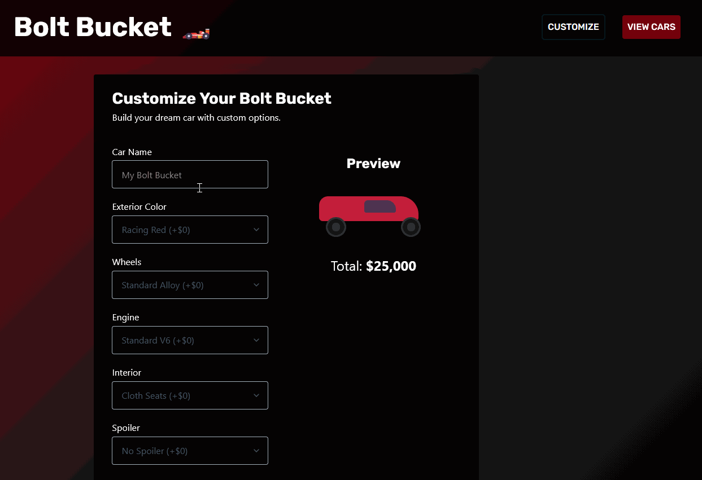

# WEB103 Project 4 - *Bolt Bucket*

Submitted by: **William Galindo**

About this web app: **Bolt Bucket is a custom car personalizer that lets users build their dream car by choosing exterior color, wheels, engine, interior, and spoiler options. The app shows a live visual preview and dynamic price as options change, saves builds to a PostgreSQL database, and supports viewing, editing, and deleting saved cars.**

Time spent: **10** hours

## Required Features

The following **required** functionality is completed:

- [x] **The web app uses React to display data from the API.**
- [x] **The web app is connected to a PostgreSQL database, with an appropriately structured `CustomItem` table.**
  - [x]  **NOTE: Your walkthrough added to the README must include a view of your Render dashboard demonstrating that your Postgres database is available**
  - [x]  **NOTE: Your walkthrough added to the README must include a demonstration of your table contents. Use the psql command 'SELECT * FROM tablename;' to display your table contents.**
- [x] **Users can view **multiple** features of the `CustomItem` (e.g. car) they can customize, (e.g. wheels, exterior, etc.)**
- [x] **Each customizable feature has multiple options to choose from (e.g. exterior could be red, blue, black, etc.)**
- [x] **On selecting each option, the displayed visual icon for the `CustomItem` updates to match the option the user chose.**
- [x] **The price of the `CustomItem` (e.g. car) changes dynamically as different options are selected *OR* The app displays the total price of all features.**
- [x] **The visual interface changes in response to at least one customizable feature.**
- [x] **The user can submit their choices to save the item to the list of created `CustomItem`s.**
- [x] **If a user submits a feature combo that is impossible, they should receive an appropriate error message and the item should not be saved to the database.**
- [x] **Users can view a list of all submitted `CustomItem`s.**
- [x] **Users can edit a submitted `CustomItem` from the list view of submitted `CustomItem`s.**
- [x] **Users can delete a submitted `CustomItem` from the list view of submitted `CustomItem`s.**
- [x] **Users can update or delete `CustomItem`s that have been created from the detail page.**

The following **optional** features are implemented:

- [x] Selecting particular options prevents incompatible options from being selected even before form submission

The following **additional** features are implemented:

- [x] Shared `CarForm` component used for both create and edit pages
- [x] Live car preview with exterior color, wheel rim styling, and spoiler visuals
- [x] Server-side validation that mirrors client-side combo rules
- [x] React Router navigation with edit/delete actions on list and detail pages

## Video Walkthrough

Here's a walkthrough of implemented required features:

GIF created with ScreenToGif

## Notes

The app stores custom cars in a PostgreSQL `cars` table hosted on Render. Impossible combinations (electric engine + racing spoiler, off-road wheels + racing spoiler) are blocked in the UI and rejected by the API with an error message.

The walkthrough GIF includes the Render dashboard showing the active Postgres database and a `SELECT * FROM cars;` query demonstrating saved table contents.

## License

Copyright 2026 William Galindo

Licensed under the Apache License, Version 2.0 (the "License"); you may not use this file except in compliance with the License. You may obtain a copy of the License at

> http://www.apache.org/licenses/LICENSE-2.0

Unless required by applicable law or agreed to in writing, software distributed under the License is distributed on an "AS IS" BASIS, WITHOUT WARRANTIES OR CONDITIONS OF ANY KIND, either express or implied. See the License for the specific language governing permissions and limitations under the License.
